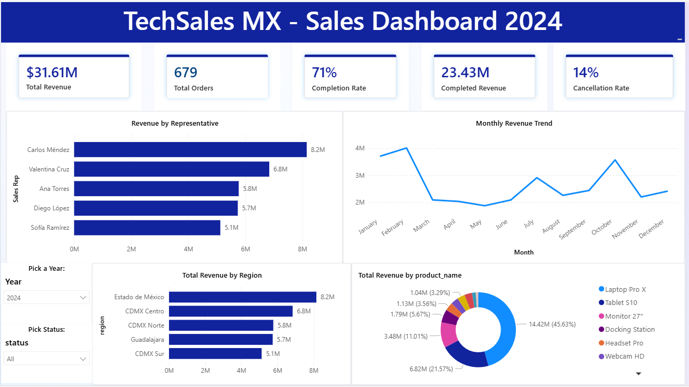

# TechSales MX — End-to-End Data Analytics Project

## Dashboard Preview

A complete data analytics and engineering project built on a fictional 
Mexican tech company dataset. Demonstrates the full analyst/engineer stack.

## Tech Stack
- **SQL** — PostgreSQL, advanced queries, window functions, CTEs
- **Python** — pandas, matplotlib, seaborn, automated reporting
- **dbt** — ELT transformation layer, data testing, documentation
- **Power BI** — live dashboard connected to PostgreSQL
- **Excel** — advanced formulas, pivot tables, dashboard

## What's Inside

### Database
- 5 related tables — 2,000 orders, 500 customers, 5 reps, 10 products
- 3 years of sales data (2022–2024)
- Built in PostgreSQL with proper foreign key relationships

### SQL Analysis
- Revenue by rep, region, product with window functions
- Month-over-month growth using LAG
- Customer segmentation with NTILE quartiles
- Executive scorecard combining CTEs, LAG, RANK, and CASE WHEN

### Python
- Full EDA pipeline — profiling, cleaning, visualization
- 6 chart types with reusable templates
- Automated Excel report generation with embedded charts
- Direct PostgreSQL connection via SQLAlchemy

### dbt Pipeline
- Staging models — stg_sales_orders, stg_reps, stg_products
- Mart models — fct_sales, mart_rep_performance
- 9 automated data quality tests
- Auto-generated documentation with lineage graph

### Power BI Dashboard
- 5 KPI cards — revenue, completion rate, cancellation rate
- Bar chart, line chart, donut chart, regional breakdown
- 3 interactive slicers — year, region, status
- Live connection to PostgreSQL

## Key Business Findings
- Carlos Méndez led revenue at $8.2M in 2024 with 73% quota attainment
- Laptop Pro X and Tablet S10 drove 63% of total revenue — concentration risk
- 2023 had highest cancellation rate at 15.47% — business recovered in 2024
- VIP customer tier underperforms Regular tier in revenue — classification issue

## Project Structure

techsales-mx/
├── techsales_dbt/          ← dbt transformation project
│   ├── models/
│   │   ├── staging/        ← cleaning models
│   │   └── marts/          ← business logic models
│   └── dbt_project.yml
├── 01_data_exploration.ipynb  ← Python EDA notebook
├── automated_report.py        ← automated Excel report
├── chart_templates.py         ← reusable chart functions
└── README.md

## Skills Demonstrated
SQL · PostgreSQL · Python · pandas · matplotlib · dbt · Power BI · 
DAX · ELT pipelines · Data modeling · Automated reporting · Git

